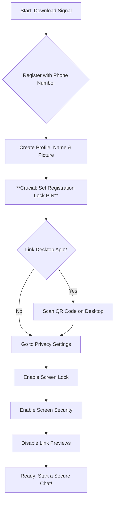

# Signal: A Detailed Security Guide for Activists

## Introduction

Signal is a free, open-source messaging application that uses end-to-end encryption to secure your communications. For activists, this means that your messages, calls, and file transfers are protected from being intercepted by third parties like corporations, governments, or hackers. Unlike other popular messaging apps, Signal is designed from the ground up with privacy and security as its core mission, making it an essential tool for organizing, coordinating, and communicating safely.

---

## Step-by-Step Setup

### On Mobile (Android/iOS)

1.  **Download Signal:**
    *   **Android:** Go to the Google Play Store and search for "Signal".
    *   **iOS:** Go to the Apple App Store and search for "Signal".
    *   **Important:** Only download Signal from the official app stores to ensure you are getting the legitimate application.

2.  **Install and Register:**
    *   Open the app after it has finished installing.
    *   Signal will ask for your phone number to register. You will receive a verification code via SMS to confirm your number.
    *   **Note:** While Signal needs a phone number to register, this number is not visible to everyone you talk to (see Sealed Sender section).

3.  **Create Your Profile:**
    *   Set up your profile name and picture. You can use a pseudonym or any name you are comfortable with.

4.  **Set Your PIN:**
    *   Signal will prompt you to create a **Registration Lock PIN**. This is crucial. It prevents others from registering your phone number on a different device. **Do not forget this PIN!** Write it down and store it somewhere safe and offline.

### On Desktop (Windows/Mac/Linux)

1.  **Download Signal Desktop:**
    *   Go to the official Signal website: `https://signal.org/download/`.
    *   Download the correct version for your operating system.

2.  **Link to Your Mobile Device:**
    *   Install and open the Signal Desktop app.
    *   It will show you a QR code.
    *   On your phone, go to Signal **Settings > Linked Devices** and tap the `+` icon.
    *   Use your phone to scan the QR code on your desktop screen.
    *   Your devices are now linked, and your messages will be synchronized.

---

## Advanced Privacy Settings

To maximize your security, enable these settings on your mobile device. You can find them under **Signal Settings > Privacy**.

### 1. Registration Lock

*   **What it does:** Prevents someone else from re-registering your phone number with Signal on a new device. It locks your account to your PIN.
*   **How to enable:**
    1.  Go to **Settings > Account**.
    2.  Toggle **Registration Lock** to ON.
    3.  You will be prompted to confirm your PIN.

### 2. Screen Lock

*   **What it does:** Requires your phone's passcode, fingerprint, or Face ID to open the Signal app.
*   **How to enable:**
    1.  Go to **Settings > Privacy**.
    2.  Toggle **Screen Lock** to ON.
    3.  Set the **Screen Lock timeout** to a short duration, like `1 Minute`.

### 3. Screen Security

*   **What it does:** Prevents Signal's content from appearing in your phone's app switcher or from being captured in screenshots on your own device.
*   **How to enable:**
    1.  Go to **Settings > Privacy**.
    2.  Toggle **Screen Security** (Android) or **Enable Screen Security** (iOS) to ON.

### 4. Disabling Link Previews

*   **What it does:** When you send or receive a link, Signal normally contacts the website to generate a preview. Disabling this prevents Signal from making that extra network request, which could reveal your IP address to the website's server.
*   **How to enable:**
    1.  Go to **Settings > Chats**.
    2.  Toggle **Generate link previews** to OFF.

### 5. Sealed Sender

*   **What it does:** This is an advanced feature that is on by default. It hides who is sending a message from Signal's servers. The server knows where to deliver a message, but not who sent it, protecting your metadata.
*   **How to check/enable:**
    1.  Go to **Settings > Privacy > Advanced**.
    2.  Ensure **Sealed Sender** is set to **Allow from everyone** for maximum privacy.

---

## Secure Group Chat Best Practices

### 1. Verify Members' Safety Numbers

*   **Why it's important:** Each one-on-one chat has a unique "safety number". Verifying this number confirms you are talking to the right person and that your connection is not being intercepted (a "man-in-the-middle" attack).
*   **How to do it:**
    1.  In a chat, tap the person's name at the top.
    2.  Select **Verify Safety Number**.
    3.  You will see a QR code and a long string of numbers.
    4.  The most secure way is to meet in person and scan each other's QR codes. If you can't meet, compare the numbers over a different secure channel (like another encrypted call).

### 2. Use Disappearing Messages Effectively

*   **Why it's important:** Automatically deletes messages after a set time, reducing the amount of sensitive information stored on devices. If a device is seized or compromised, old conversations are already gone.
*   **How to use it:**
    1.  In a group chat, tap the group name at the top.
    2.  Select **Disappearing Messages**.
    3.  Choose a duration that fits your group's needs (e.g., `1 day` or `1 week`). A shorter duration is generally safer.

### 3. Set Appropriate Group Permissions

*   **Why it's important:** Prevents unauthorized people from being added to the group or the group's purpose being changed without consensus.
*   **How to set it:**
    1.  In a group chat, tap the group name > **Group Settings**.
    2.  Set **Who can add members** to **Only admins**.
    3.  Set **Who can edit group info** to **Only admins**.

### 4. Clear Group Purpose and Member Vetting

*   **Trust is key:** Only add people to a group who are trusted by the existing members.
*   **Establish rules:** Have a clear understanding of the group's purpose. What information is okay to share? What is not?
*   **One person, one device:** Encourage members to only use Signal on one primary device if possible to reduce the risk of a compromised linked device.

---

## Setup Process Flowchart

