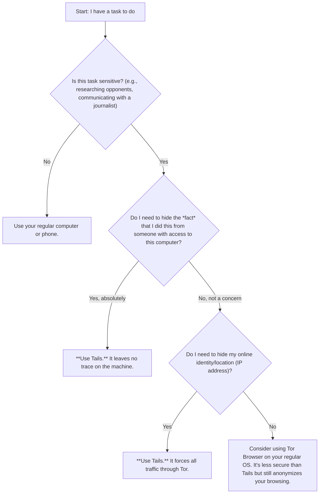

# Guide: Tails OS

Tails is a portable operating system that protects against surveillance and censorship. It forces all internet connections through the Tor network and leaves no trace on the computer you use it on.

**How to Use It:**
1.  **Download:** Get the official image from the Tails website.
2.  **Create a Bootable USB:** Use a tool like balenaEtcher to flash the Tails image onto a USB drive (at least 8GB).
3.  **Boot from USB:** Restart your computer and boot from the USB drive instead of your main OS.
4.  **Persistent Storage (Optional):** You can create an encrypted persistent volume on the USB to save files, settings, and software across reboots.

### Decision Flowchart: 'Should I Use Tails for This Task?'
Use this chart to help you decide if Tails is the right tool for what you need to do.

