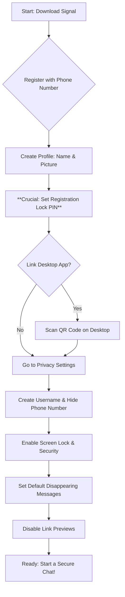

# Signal: una guía de seguridad detallada para activistas

## Introducción

Signal es una aplicación de mensajería gratuita y de código abierto que utiliza cifrado de extremo a extremo para proteger sus comunicaciones. Para los activistas, esto significa que sus mensajes, llamadas y transferencias de archivos están protegidos contra ser interceptados por terceros como corporaciones, gobiernos o piratas informáticos. A diferencia de otras aplicaciones de mensajería populares, Signal está diseñada desde cero con la privacidad y la seguridad como su misión principal, lo que la convierte en una herramienta esencial para organizar, coordinar y comunicarse de forma segura.

---

## Configuración paso a paso

### En dispositivos móviles (Android/iOS)

1. **Señal de descarga:**
    * **Android:** Vaya a Google Play Store y busque "Signal".
    * **iOS:** Vaya a la App Store de Apple y busque "Signal".
    * **Importante:** Descargue Signal únicamente desde las tiendas de aplicaciones oficiales para asegurarse de que está obteniendo la aplicación legítima.

2. **Instalar y registrar:**
    * Abra la aplicación una vez que haya terminado de instalarse.
    * Signal te pedirá tu número de teléfono para registrarte. Recibirás un código de verificación por SMS para confirmar tu número.
    * **Nota:** Si bien Signal necesita un número de teléfono para registrarse, este número no es visible para todas las personas con las que habla (consulte la sección Remitente sellado).

3. **Crea tu perfil:**
    * Configure su nombre e imagen de perfil. Puede utilizar un seudónimo o cualquier nombre con el que se sienta cómodo.

4. **Establezca su PIN:**
    * Signal te pedirá que crees un **PIN de bloqueo de registro**. Esto es crucial. Evita que otros registren su número de teléfono en un dispositivo diferente. **¡No olvides este PIN!** Anótalo y guárdalo en un lugar seguro y sin conexión.

### En el escritorio (Windows/Mac/Linux)

1. **Descargar Signal Desktop:**
    * Vaya al sitio web oficial de Signal: `https://signal.org/download/`.
    * Descargue la versión correcta para su sistema operativo.

2. **Enlace a su dispositivo móvil:**
    * Instale y abra la aplicación Signal Desktop.
    * Te mostrará un código QR.
    * En tu teléfono, ve a Signal **Configuración > Dispositivos vinculados** y toca el ícono `+`.
    * Utilice su teléfono para escanear el código QR en la pantalla de su escritorio.
    * Tus dispositivos ahora están vinculados y tus mensajes se sincronizarán.

---

## Configuración de privacidad avanzada

Para maximizar su seguridad, habilite estas configuraciones en su dispositivo móvil. Puede encontrarlos en **Configuración de señal > Privacidad**.

### 1. Bloqueo de registro

* **Qué hace:** Evita que otra persona vuelva a registrar tu número de teléfono con Signal en un dispositivo nuevo. Bloquea su cuenta con su PIN.
* **Cómo habilitar:**
    1. Vaya a **Configuración > Cuenta**.
    2. Active **Bloqueo de registro**.
    3. Se le pedirá que confirme su PIN.

### 2. Bloqueo de pantalla

* **Qué hace:** Requiere el código de acceso, la huella digital o el Face ID de tu teléfono para abrir la aplicación Signal.
* **Cómo habilitar:**
    1. Vaya a **Configuración > Privacidad**.
    2. Active **Bloqueo de pantalla**.
    3. Establezca el **Tiempo de espera de bloqueo de pantalla** en una duración corta, como "1 minuto".

### 3. Seguridad de pantalla

* **Qué hace:** Evita que el contenido de Signal aparezca en el selector de aplicaciones de tu teléfono o que se capture en capturas de pantalla en tu propio dispositivo.
* **Cómo habilitar:**
    1. Vaya a **Configuración > Privacidad**.
    2. Active **Seguridad de pantalla** (Android) o **Activar seguridad de pantalla** (iOS).

### 4. Deshabilitar las vistas previas de enlaces

* **Qué hace:** Cuando envías o recibes un enlace, Signal normalmente se comunica con el sitio web para generar una vista previa. Deshabilitar esto evita que Signal realice esa solicitud de red adicional, lo que podría revelar su dirección IP al servidor del sitio web.
* **Cómo habilitar:**
    1. Vaya a **Configuración > Chats**.
    2. Desactive **Generar vistas previas de enlaces**.

### 5. Oculte su número de teléfono (nombres de usuario de Signal)

* **Qué hace:** Signal ahora te permite ocultar tu número de teléfono a las personas con las que chateas creando un "nombre de usuario" único. Esta es una mejora de seguridad masiva para los activistas, que previene el doxing o la vigilancia dirigida basada en su número de teléfono real.
* **Cómo habilitar:**
    1. Vaya a **Configuración > Perfil** y cree un **Nombre de usuario** (por ejemplo, `nombre_activista.01`).
    2. Vaya a **Configuración > Privacidad > Número de teléfono**.
    3. Configure **Quién puede ver mi número de teléfono** en **Nadie**.
    4. Establezca **Quién puede encontrarme por número** en **Nadie** (esto obliga a las personas a usar su nombre de usuario exacto o un código QR para conectarse con usted).

### 6. Mensajes que desaparecen predeterminados

* **Qué hace:** Aplica automáticamente un temporizador de mensajes que desaparecen a *todos los chats nuevos* que inicies. Esto garantiza que nunca olvidará habilitarlo.
* **Cómo habilitar:**
    1. Vaya a **Configuración > Privacidad > Temporizador predeterminado para chats nuevos**.
    2. Configúrelo según la duración que prefiera (por ejemplo, "1 semana" o "4 semanas").

### 7. Remitente sellado

* **Qué hace:** Esta es una función avanzada que está activada de forma predeterminada. Oculta quién envía un mensaje desde los servidores de Signal. El servidor sabe dónde entregar un mensaje, pero no quién lo envió, protegiendo sus metadatos.
* **Cómo comprobar/habilitar:**
    1. Vaya a **Configuración > Privacidad > Avanzado**.
    2. Asegúrese de que **Remitente sellado** esté configurado en **Permitir a todos** para obtener la máxima privacidad.

---

## Mejores prácticas de chat grupal seguro

### 1. Verificar los números de seguridad de los miembros

* **Por qué es importante:** Cada chat individual tiene un "número de seguridad" único. Verificar este número confirma que estás hablando con la persona adecuada y que tu conexión no está siendo interceptada (un ataque de "intermediario").
* **Cómo hacerlo:**
    1. En un chat, toca el nombre de la persona en la parte superior.
    2. Seleccione **Verificar número de seguridad**.
    3. Verás un código QR y una larga cadena de números.
    4. La forma más segura es reunirse en persona y escanear los códigos QR de cada uno. Si no pueden reunirse, compare los números a través de un canal seguro diferente (como otra llamada cifrada).

### 2. Utilice mensajes que desaparecen de forma eficaz

* **Por qué es importante:** Elimina mensajes automáticamente después de un tiempo determinado, lo que reduce la cantidad de información confidencial almacenada en los dispositivos. Si un dispositivo es incautado o comprometido, las conversaciones antiguas ya desaparecerán.
* **Cómo usarlo:**
    1. En un chat grupal, toque el nombre del grupo en la parte superior.
    2. Seleccione **Mensajes que desaparecen**.
    3. Elija una duración que se ajuste a las necesidades de su grupo (por ejemplo, "1 día" o "1 semana"). Una duración más corta es generalmente más segura.

### 3. Establecer permisos de grupo adecuados

* **Por qué es importante:** Evita que se agreguen personas no autorizadas al grupo o que se cambie el propósito del grupo sin consenso.
* **Cómo configurarlo:**
    1. En un chat grupal, toque el nombre del grupo > **Configuración del grupo**.
    2. Establezca **Quién puede agregar miembros** en **Solo administradores**.
    3. Establezca **Quién puede editar la información del grupo** en **Solo administradores**.

### 4. Propósito claro del grupo y verificación de antecedentes de los miembros

* **La confianza es clave:** Agregue únicamente personas a un grupo en las que confíen los miembros existentes.
* **Establecer reglas:** Tener una comprensión clara del propósito del grupo. ¿Qué información está bien compartir? ¿Qué no lo es?
* **Una persona, un dispositivo:** Aliente a los miembros a usar Signal solo en un dispositivo principal si es posible para reducir el riesgo de que un dispositivo vinculado esté comprometido.

---

## Diagrama de flujo del proceso de configuración

_Última actualización: 2026_