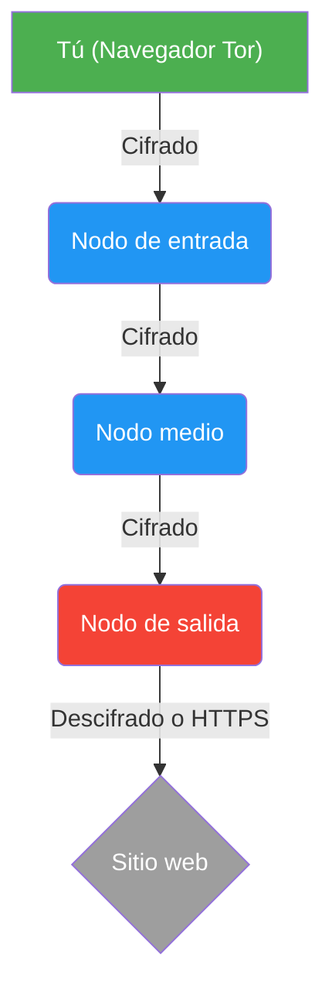

# Navegador Tor: anonimato profundo y configuración Edge-Case

*Estado: Arquitectura de red de anonimato | Público: denunciantes, investigadores de OSINT y objetivos de alto riesgo*

El Navegador Tor no proporciona "privacidad", sino **anonimato**. La privacidad es decidir *qué* le muestras al mundo; El anonimato es garantizar que el mundo no sepa *quién* eres. Si bien el enrutamiento cebolla subyacente de Tor es criptográficamente robusto, la mayoría de los ataques de desanonimización tienen éxito porque los usuarios cometen errores de comportamiento o de configuración en los puntos finales.

Esta guía detalla los estrictos protocolos de implementación necesarios para sobrevivir a la inspección profunda de paquetes (DPI) y a la toma de huellas digitales avanzada del navegador.

---

## 1. Tor frente a VPN: una distinción fundamental

Los activistas suelen confundir las VPN y Tor. Tienen propósitos completamente diferentes:

* **VPN (red privada virtual):** Transfiere la confianza de su proveedor de servicios de Internet (ISP) a una empresa de VPN corporativa. Oculta su tráfico de su red local y cambia su dirección IP, pero el proveedor de VPN *podría* registrar su actividad. **Una VPN NO te hace anónimo.** Si las autoridades citan una VPN (y registran datos), tu identidad se ve comprometida.
* **Navegador Tor:** Diseñado específicamente para el **anonimato**. El cifrado de múltiples capas hace que sea matemáticamente inviable para *cualquiera* (incluidos los nodos individuales en la red Tor) vincular su carga útil de tráfico a su dirección IP.

## 2. Eludir la censura: transportes y puentes conectables

En entornos hostiles (regímenes autoritarios, redes corporativas, Wi-Fi universitario), los adversarios implementan la inspección profunda de paquetes (DPI) para identificar la firma criptográfica del tráfico Tor y bloquearla. Para anular el DPI, debes utilizar un transporte conectable (un puente).

Un Puente es un Nodo de Entrada no listado que disfraza su tráfico Tor para que parezca tráfico web estándar y benigno.

* **`obfs4` (Ofuscación 4):** La defensa estándar. Envuelve el tráfico de Tor en una capa de ofuscación, haciéndolo parecer un ruido aleatorio e irreconocible. Utilízalo si tu ISP simplemente bloquea los nodos Tor conocidos.
* **`Snowflake`:** Un transporte entre pares altamente resistente. Enruta su conexión inicial a través de servidores proxy temporales administrados por voluntarios en países sin censura que utilizan WebRTC, lo que hace que su tráfico parezca una videollamada estándar. Úselo contra cortafuegos nacionales altamente sofisticados.
* **`meek_azure`:** Dirige su tráfico a través de la infraestructura de nube Azure de Microsoft. El censor ve que te conectas a Microsoft, no a Tor. Para bloquear esto es necesario bloquear Azure por completo (Domain Fronting), algo que los censores son reacios a hacer debido al daño económico.

**Configuración:** Si Tor no logra conectarse, navegue hasta **Configuración > Conexión > Puentes** y seleccione un puente integrado o solicite uno directamente desde el Proyecto Tor.

## 3. Protocolos de comportamiento estrictos (venciendo las huellas dactilares)

Cuando usas Tor, tu objetivo es integrarte con todos los demás usuarios de Tor. Cualquier desviación del perfil predeterminado lo hace único, lo que permite a los rastreadores construir una "huella digital del navegador" y desanonimizarlo.

### 1. Maximice el control deslizante de seguridad
De forma predeterminada, Tor permite la ejecución de scripts web estándar para garantizar que los sitios web no fallen. Para la seguridad operativa, esto es inaceptable.
* Haga clic en el **Icono de escudo** en la barra de URL.
* Seleccione **Configuración de seguridad avanzada**.
* Cambie el nivel a **Más seguro**. Esto deshabilita completamente JavaScript (JS) a nivel mundial. Malicious JS es el vector principal utilizado por los adversarios a nivel estatal para explotar los navegadores y ejecutar malware de anonimización. Si un sitio exige que JS funcione, busque otro sitio.

### 2. Nunca cambie el tamaño de la ventana del navegador
Cuando maximiza una ventana del navegador, el sitio web solicita las dimensiones exactas en píxeles de su pantalla. Esto crea una "huella digital de lienzo" matemática muy exclusiva basada en el tamaño específico del monitor y la representación de gráficos.
* **Regla:** Deje la ventana del Navegador Tor exactamente en el tamaño predeterminado en el que se abre. No haga clic en maximizar.

### 3. La regla de la red clara de tolerancia cero
El error más catastrófico que puede cometer un activista es "tender puentes".
* **Regla:** Nunca inicies sesión en una cuenta personal con nombre real (Facebook, Gmail personal, cuenta bancaria) mientras utilizas el navegador Tor.
* *Mecánica:* Si inicias sesión en tu Facebook personal a través de Tor, acabas de vincular permanentemente tu circuito de nodo de salida anónimo de Tor directamente a tu verdadera identidad en la base de datos de Facebook. Si luego visita un foro de activistas en otra pestaña dentro de la misma sesión, los rastreadores pueden unir esas identidades.

## 4. Manejo operativo de archivos

* **No abra descargas mientras esté en línea:** Si descarga un documento (PDF, Word) a través de Tor, no lo abra mientras esté conectado a Internet. Muchos formatos de documentos contienen rastreadores o macros integrados diseñados para "llamar a casa" a un servidor en el momento en que se abren, evitando Tor y revelando su verdadera dirección IP.
* **Mitigación:** Desconéctese completamente de Internet antes de abrir cualquier archivo descargado, o ábralo exclusivamente dentro de un `DispVM` aislado en Qubes OS o en un entorno Tails OS sin acceso a la red.

_Última actualización: 2026_


