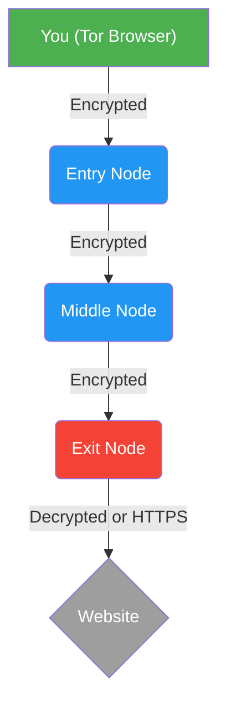

# Una guía para el navegador Tor: su puerta de entrada al anonimato

## ¿Qué es el navegador Tor?

El Navegador Tor es un navegador web gratuito y de código abierto diseñado para proteger su anonimato en línea.Es su herramienta más poderosa para navegar por Internet sin revelar su verdadera ubicación o identidad.Es desarrollado y mantenido por Tor Project, una organización sin fines de lucro dedicada a promover los derechos humanos y las libertades mediante la creación e implementación de tecnologías de privacidad y anonimato gratuitas y de código abierto.

Cuando utiliza un navegador normal (como Chrome, Firefox o Safari), su tráfico de Internet viaja directamente desde su dispositivo al sitio web que está visitando.Esto significa que el sitio web, su proveedor de servicios de Internet (ISP) y cualquier observador de la red pueden ver quién es usted y qué está mirando.El Navegador Tor cambia esta dinámica por completo.

## ¿Cómo funciona?La magia del enrutamiento de cebollas

Tor te protege utilizando una técnica llamada "enrutamiento cebolla".Es un proceso inteligente que es más fácil de entender con una analogía.

Imagina que quieres enviar un mensaje secreto a un amigo.En lugar de enviarlo directamente, haces lo siguiente:

1. Tomas tu mensaje, lo pones en un cuadro pequeño y escribes en él la dirección de tu amigo.
2. Luego colocas esa pequeña caja dentro de una caja un poco más grande y la diriges a una persona al azar, llamémosla Persona A.
3. Luego colocas *esa* caja dentro de una caja aún más grande y la diriges a otra persona al azar, la Persona B.

Cuando la Persona B recibe la caja más grande, la abre y encuentra la caja dirigida a la Persona A. La reenvía.La persona A recibe su caja, la abre y encuentra la última caja dirigida a su amigo.Lo envían a su destino final.

Así es como funciona Tor.Su tráfico de Internet está envuelto en múltiples capas de cifrado, como las capas de una cebolla:

* **Nodo de entrada:** Su tráfico primero va a una computadora aleatoria en la red Tor (el Nodo de entrada).Este nodo sabe quién es usted, pero no adónde se dirige en última instancia.
* **Nodo intermedio:** Luego, el tráfico se envía a al menos otra computadora aleatoria (el nodo intermedio).Este nodo sólo sabe que el tráfico proviene del nodo de entrada y se dirige al nodo de salida.No sabe nada sobre ti ni sobre tu destino final.
* **Nodo de salida:** Finalmente, su tráfico va a una tercera computadora aleatoria (el nodo de salida).Este nodo envía su tráfico al sitio web real que desea visitar.Conoce el destino final pero no tiene idea de quién eres.

Esta ruta aleatoria de múltiples capas hace que sea extremadamente difícil para cualquiera rastrear su actividad en Internet hasta usted.

## ¿Cuándo debería utilizar el navegador Tor?

* **Para proteger su identidad:** Cuando necesita investigar temas delicados sin vincular esa actividad a su identidad en el mundo real.
* **Para evitar la censura:** Si vives o viajas por un país que bloquea ciertos sitios web o servicios, Tor puede ayudarte a acceder a Internet abierto.
* **Para privacidad general:** Para evitar que los anunciantes, su ISP y los sitios web creen un perfil suyo en función de sus hábitos de navegación.

## Limitaciones críticas: lo que Tor NO hace

Comprender las limitaciones de Tor es esencial para utilizarlo de forma segura.

1. **El nodo de salida es un punto débil:** El tráfico que sale de la computadora final (el nodo de salida) y va al sitio web **ya no está cifrado por Tor**.Si el sitio web que está visitando no utiliza HTTPS (el pequeño icono de candado en la barra de direcciones), entonces la persona que ejecuta el nodo de salida puede ver su tráfico.**Asegúrese siempre de conectarse a sitios web HTTPS cuando utilice Tor.**

2. **Tor no te hace invencible:** Tor anonimiza tu conexión, pero no te protege de tus propias acciones.Si inicias sesión en una cuenta (como Facebook o tu correo electrónico) usando Tor, acabas de decirle a ese servicio exactamente quién eres.Para un verdadero anonimato, no inicie sesión en cuentas personales.

3. **Puede ser lento:** Debido a que su tráfico rebota en todo el mundo, usar Tor es notablemente más lento que un navegador normal.No es ideal para transmitir videos o descargar archivos grandes.

4. **No protege toda tu computadora:** El navegador Tor solo protege el tráfico que pasa por el navegador.No anonimiza la actividad de otras aplicaciones en su computadora.

## Tor frente a VPN: ¿Cuál es la diferencia?

Los activistas suelen confundir las VPN y Tor.Tienen propósitos completamente diferentes:

* **VPN (red privada virtual):** Transfiere la confianza de su proveedor de servicios de Internet (ISP) a la empresa de VPN.Oculta su tráfico de su red local y de su ISP, y cambia su dirección IP.**Una VPN NO te hace anónimo.** Si las autoridades citan a una VPN (y la VPN registra datos), tu identidad se ve comprometida.Utilice una VPN para privacidad general, descarga de torrents o acceso a contenido bloqueado geográficamente.
* **Navegador Tor:** Diseñado específicamente para el **anonimato**.El cifrado de múltiples capas (enrutamiento cebolla) hace que sea increíblemente difícil para *cualquiera* (incluidos los nodos de la red Tor) vincular su tráfico con su identidad.Utilice Tor para realizar investigaciones de alto riesgo, comunicarse con periodistas o denunciar irregularidades.

## ¿Qué pasa si Tor está bloqueado?(Usando puentes)

En algunos países o en redes altamente restrictivas (como Wi-Fi corporativa o universitaria), la red pública Tor puede estar bloqueada.

Para evitar esta censura, Tor utiliza **Bridges**.Los puentes son nodos de entrada de Tor no listados que son mucho más difíciles de identificar y bloquear para los censores.

* **Cómo usar:** Cuando abres el Navegador Tor y no se puede conectar, ve a Configuración de Red Tor.Seleccione "Usar un puente" y elija uno de los puentes integrados (como `obfs4`), o solicite un nuevo puente directamente desde el Proyecto Tor dentro de la configuración.

---

El navegador Tor es la piedra angular de la privacidad digital.Si comprende cómo funciona y sus limitaciones, podrá utilizarlo de forma eficaz para proteger su identidad y explorar Internet con confianza.

_Última actualización: 2026_