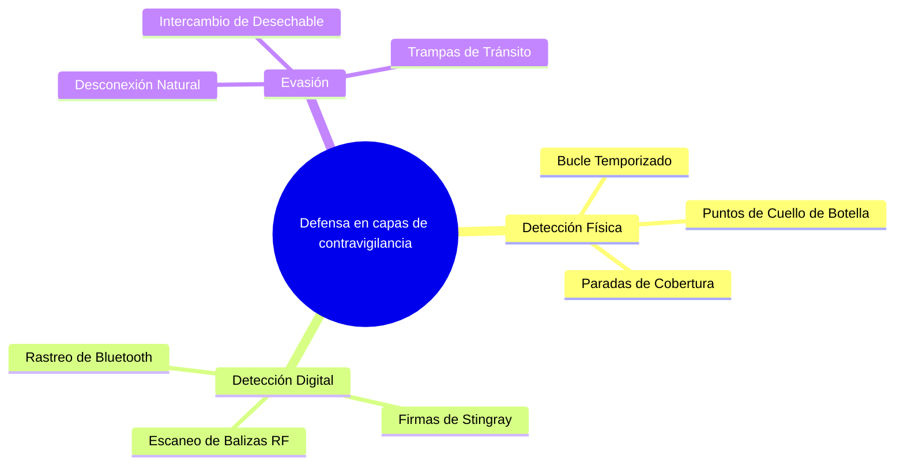

# La guía del activista para la contravigilancia: convergencia físico-digital

*Estado: Manual de campo | Público: Organizadores, Equipos de Acción Directa, Nodos de Alto Riesgo*

La contravigilancia no consiste en luchar contra el adversario; es el arte estratégico de detectar su presencia y romper su línea de visión *sin* hacerles saber que lo has hecho. Exhibir abiertamente una conciencia de contravigilancia (por ejemplo, mirar fijamente a una cola, giros repentinos en U, conducción errática) aumenta el nivel de amenaza y lo marca como un objetivo sofisticado.

Este manual dicta los protocolos para la detección pasiva y la evasión segura en dominios físicos y de RF (radiofrecuencia).

---

## 1. Detección física: el arte del 'bucle cronometrado'

Debe asumir que lo están siguiendo durante operaciones delicadas. Su objetivo es obligar al equipo de vigilancia a revelarse creando restricciones geográficas antinaturales.

### El método del bucle cronometrado
Nunca viaje directamente desde el punto A (casa segura) al punto B (reunión operativa). Implementar un bucle de análisis de ruta.
1. **Establezca un punto de estrangulamiento:** Seleccione una ruta de transporte que obligue a todo el tráfico a pasar por un cuello de botella específico e inevitable (por ejemplo, un puente largo, un túnel, una calle residencial tranquila sin desvíos inmediatos).
2. **El primer paso:** Transitar por el punto de estrangulamiento. Registre mentalmente (o use una grabadora de voz discreta) las descripciones de los tres vehículos directamente detrás de usted y de los peatones que merodean en la salida.
3. **El bucle:** Ejecute un bucle grande y de apariencia natural. Vaya a una cafetería, explore una librería durante 20 minutos (una **Parada de portada**) y luego regrese al punto de estrangulamiento desde un ángulo diferente.
4. **El segundo paso:** Transita exactamente por el mismo punto de estrangulamiento.
5. **Evaluación:** Si alguno de los vehículos o peatones del Primer Paso está presente durante el Segundo Paso, se encuentra bajo vigilancia activa. *No reacciones.*

### Reconocer la dinámica del equipo
La vigilancia profesional (T3/T4) nunca es de un solo coche. Es una "caja flotante".
* **El vehículo de comando:** Permanece paralelo y recorre una cuadra.
* **El seguidor:** Se queda atrás y frecuentemente pasa el liderazgo a otro vehículo para evitar ser detectado.
* **El ojo:** Un peatón o ciclista estacionado en su destino incluso antes de llegar.

---

## 2. Detección digital: identificación del seguimiento de RF activo

La vigilancia moderna depende en gran medida de la radiofrecuencia (RF). Si no pueden verte físicamente, están rastreando tus emisiones digitales.

### Detección de monitoreo de multitudes por Wi-Fi / Bluetooth
La policía local (T2) despliega rastreadores de RF móviles en las zonas de protesta para recolectar direcciones MAC de todos los dispositivos en el área, mapear a la multitud e identificar a los organizadores.
* **Protocolo:** Antes de ingresar a una zona operativa, coloque su dispositivo principal en modo avión. **Lo más importante es que también debes desactivar manualmente Wi-Fi y Bluetooth.** El modo avión en los teléfonos inteligentes modernos *no* desactiva automáticamente las balizas Bluetooth en segundo plano (como la red "Find My" de Apple), que continúan transmitiendo la firma única de tu dispositivo a los escáneres.

### Identificación de IMSI-Catchers (rayas)
Las mantarrayas imitan las torres de telefonía móvil, lo que obliga a su teléfono a conectarse a ellas para recopilar su número IMSI y rastrear su ubicación.
* **Firmas de un ataque:**
    *   Sudden, unexplained drop from 5G/4G down to 2G (EDGE) networks. (Stingrays often force phones onto older, unencrypted 2G protocols to intercept data).
    *   Unusually rapid battery drain.
    *   Failure of calls/texts to transmit despite showing "full bars" of signal.
* **Contramedida:** En Android (específicamente en sistemas operativos reforzados como GrapheneOS), navegue hasta Configuración de red y **Desactive 2G**. Esto anula los ataques de degradación más comunes. Si sospecha que hay un Stingray activo, apague el dispositivo por completo y colóquelo en una bolsa de Faraday.

---

## 3. Evasión: El protocolo de ruptura segura

Si confirmas la vigilancia, tu objetivo es "romper la cola" de forma natural. Debes proporcionarle al equipo de vigilancia una razón plausible e inocente para perderte.

### Desconexión natural
* **No:** Correr, conducir de forma errática o enfrentarse a la vigilancia.
* **Sí:** Ingrese a un entorno muy concurrido y con múltiples salidas (un gran almacén, una estación de metro concurrida, el vestíbulo de un hotel denso).
* **La trampa del metro:** Ingresa a una estación de metro. Espere en el andén hasta que se cierren las puertas del tren. Sube al tren en el último segundo posible. Si el agente de vigilancia intenta seguirlo, debe correr hacia las puertas (revelándose) o quedarse atrás. Si se quedan atrás, asumirán que usted simplemente tomó el tren, no que los estaba evadiendo.

### El intercambio de quemadores (pausa digital)
Si debe romper la vigilancia digital (por ejemplo, están rastreando la ubicación de su teléfono):
1. Ingrese una "Parada de cobertura" (por ejemplo, el baño de un centro comercial o una cafetería llena de gente).
2. Apague su dispositivo principal. Retire la batería si es posible o colóquela inmediatamente en una bolsa de Faraday.
3. Encienda un dispositivo quemador desvinculado y preconfigurado.
4. Salga de Cover Stop usando una salida diferente. El seguimiento digital del adversario permanecerá congelado en Cover Stop.

**Directiva:** La operación de contravigilancia más exitosa es aquella en la que el adversario regresa a la base creyendo que eres simplemente un objetivo aburrido y poco interesante que fue de compras y se fue a casa.

_Última actualización: 2026_
