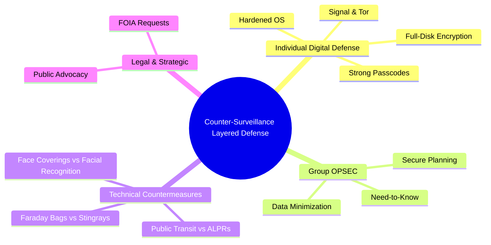

# La guía del activista para la contravigilancia

Esta guía proporciona una estrategia de defensa en capas para que los activistas protejan su privacidad, seguridad y capacidad de organizarse contra la vigilancia gubernamental y municipal.Estos no son conceptos teóricos;son pasos prácticos y viables para crear un entorno más seguro para la disidencia.

---

## Capa 1: Defensa Digital Individual (La Fundación)

Su seguridad personal es la base de la seguridad de su grupo.Si la vida digital de una persona se ve comprometida, puede exponer toda la red.Trate estos pasos como obligatorios.

### Línea de base segura: su armadura digital

1. **Cifrado de disco completo (FDE):** Esto hace que los datos de su computadora sean ilegibles sin su contraseña.Si su dispositivo es confiscado, sus datos permanecen seguros.Los sistemas operativos modernos (Windows, macOS, Linux) y los teléfonos inteligentes lo tienen integrado.**Acción:** Asegúrese de que FDE esté habilitado en todos sus dispositivos (portátiles y teléfonos).Por lo general, está activado de forma predeterminada, pero verifíquelo en su configuración de seguridad.

2. **Códigos de acceso seguros, no datos biométricos:** Las autoridades policiales pueden exigir legalmente su huella digital o su rostro en muchas jurisdicciones.Una contraseña segura no puede hacerlo.
* **Acción:** Utilice una contraseña larga y única (al menos 12 caracteres con números, símbolos y mayúsculas y minúsculas) para su teléfono y computadora.Desactive el desbloqueo facial y de huellas dactilares, especialmente cuando se dirija a una protesta.

3. **Actualizaciones periódicas de software:** Las actualizaciones no son sólo para nuevas funciones;contienen parches críticos para las vulnerabilidades de seguridad que explotan los gobiernos y los piratas informáticos.
* **Acción:** Habilite las actualizaciones automáticas en todos sus dispositivos y aplicaciones.No los retrases.

### Seguridad en las comunicaciones: hable libremente

1. **Signal para todas las comunicaciones confidenciales:** Signal utiliza cifrado de extremo a extremo, lo que significa que solo usted y el destinatario pueden leer sus mensajes.Su proveedor de telecomunicaciones, el gobierno e incluso la propia Signal no pueden acceder a su contenido.
* **Acción:** Mandato Signal para todos los chats grupales y conversaciones confidenciales uno a uno.Configure los mensajes para que desaparezcan de forma predeterminada (por ejemplo, después de una semana) para minimizar el rastro de datos.

2. **Verifique los números de seguridad:** Este paso garantiza que está hablando con la persona adecuada y no con un impostor o un ataque de intermediario.
* **Cómo hacerlo:** En un chat de Signal, toca el nombre de la persona en la parte superior y luego "Ver número de seguridad".Compara este número con tu contacto en persona o mediante otro canal seguro (como una videollamada en Signal).Si coinciden, márquelo como verificado.

### Anonimato: cuando necesitas desaparecer

1. **Navegador Tor para investigación:** Al investigar temas delicados, Tor oculta su dirección IP, evitando que los sitios web y los observadores de la red sepan quién es usted y desde dónde se conecta.
* **Cuándo usarlo:** Use Tor para investigar grupos de oposición, acceder a sitios web bloqueados o cualquier actividad en línea que no desee vincular a su identidad real.
* **Acción:** Descargue y use Tor Browser desde el sitio web oficial: `torproject.org`.

2. **SO Tails para actividades de alto riesgo:** Tails es un sistema operativo completo que se ejecuta desde una memoria USB.Fuerza todo tu tráfico de Internet a través de Tor y no deja rastro en la computadora en la que lo usas.
* **Cuándo usarlo:** Utilice Tails para tareas de alto riesgo, como filtrar documentos a un periodista o comunicarse como denunciante.
* **Acción:** Esta es una herramienta avanzada.Si tu trabajo implica un alto riesgo personal, investiga y aprende a utilizar Tails OS correctamente.

### Seguridad móvil: fortaleciendo su dispositivo más vulnerable

Su teléfono inteligente es un dispositivo de seguimiento.Para un activismo serio, es necesario tomar medidas serias.

* **GrapheneOS o CalyxOS:** Estas son versiones de Android con privacidad reforzada que le brindan control granular sobre su dispositivo, limitan el seguimiento y lo protegen de la vigilancia móvil sofisticada.
* **Acción:** Si eres un organizador clave o enfrentas un riesgo significativo, adquirir un teléfono Google Pixel e instalar GrapheneOS o CalyxOS es una de las medidas defensivas más poderosas que puedes tomar.Esta es una defensa principal contra las vulnerabilidades móviles y el seguimiento de la ubicación.

---

## Capa 2: Seguridad operativa grupal (OPSEC)

OPSEC es la práctica de proteger los planes y actividades de su grupo.Es una forma de pensar, no sólo una herramienta.

### El principio de necesidad de saber

Limitar la difusión de información.Cuantas menos personas conozcan un detalle, menor será el riesgo de que se filtre, ya sea accidentalmente o a través de un informante.

* **Acción:** Antes de compartir cualquier dato (quién, qué, cuándo, dónde, por qué), pregúntese: "¿Esta persona *necesita* absolutamente saber esto para que la acción tenga éxito?"Si la respuesta es no, no la compartas.

### Protocolo de planificación segura

Cómo planificas es tan importante como lo que planificas.La planificación insegura es un regalo para su oposición.

* **Plataformas prohibidas:** NUNCA planifique acciones en Facebook (grupos públicos o privados), Instagram, mensajes directos de Twitter, SMS/mensajes de texto o correo electrónico estándar.Estas plataformas son monitoreadas de forma rutinaria.
* **Métodos seguros:**
1. **En persona:** El método más seguro, siempre que pueda asegurarse de que la ubicación sea privada y que los asistentes hayan dejado sus teléfonos.
2. **Chats grupales cifrados:** Utilice Signal para toda la planificación digital.
3. **Documentos anónimos:** Utilice herramientas como CryptPad o Etherpad (alojadas en un servidor confiable) para documentos de planificación colaborativa en lugar de Google Docs.

### Minimización de datos

No cree datos que puedan usarse en su contra.Si no existe, no se puede robar, filtrar ni citar.

* **Acción:**
* **Sin listas de miembros:** No cree ni almacene listas centralizadas de miembros o seguidores.
* **No se permiten actas de reuniones con nombres:** Si debe tomar notas, concéntrese en los elementos de acción, no en quién dijo qué.
* **Borrar datos:** Elimina periódicamente historiales de chat y documentos antiguos que ya no sean necesarios.

---

## Capa 3: Contramedidas técnicas directas

Estas son medidas activas para derrotar tecnologías de vigilancia específicas que pueda encontrar.

### Contrarrestar las mantarrayas (IMSI-Catchers)

Las mantarrayas son torres de telefonía celular falsas utilizadas por la policía para rastrear los teléfonos de todas las personas en un área determinada.Son una herramienta de vigilancia.

* **Mejor defensa:** La defensa más efectiva es negarle tu señal.
* **Acción:** Cuando estés cerca de una protesta o de un lugar sensible, apaga tu teléfono por completo **apagado**.Si debe tenerlo activado para comunicarse, use el **Modo avión** siempre que no lo esté usando activamente.Wi-Fi y Bluetooth también deben estar apagados.
* **Defensa avanzada:** GrapheneOS proporciona controles de seguridad de red mejorados, incluida la capacidad de desactivar la conectividad 2G, lo que puede ayudar a mitigar algunos ataques de Stingray.

### Contrarrestar el reconocimiento facial

El reconocimiento facial se utiliza para identificar a los manifestantes a partir de fotografías y vídeos, a menudo mucho después de un evento.

* **Romper el algoritmo:** Su objetivo es ocultar las características clave que utilizan los algoritmos para la identificación (ojos, nariz, boca, mandíbula).
* **Acción:** Use protectores faciales eficaces.Una combinación de una máscara que se ajuste bien, gafas de sol y un sombrero o capucha es muy eficaz.Ciertos patrones de maquillaje (como CV Dazzle) también pueden funcionar, pero son menos sutiles.
* **Proteja a otros:** No publique en línea fotografías o videos identificables de otros manifestantes sin su consentimiento explícito y entusiasta.Desenfocar las caras antes de publicar es una buena práctica.

### Contrarrestar los lectores automatizados de matrículas (ALPR)

Los ALPR son cámaras montadas en coches de policía, farolas y grúas que escanean y registran constantemente las matrículas, creando una base de datos masiva de los movimientos de los vehículos.

* **Acción:** Evite conducir directamente a lugares sensibles o protestas.Estaciona a varias cuadras en una zona comercial concurrida, o mejor aún, utiliza el transporte público o anda en bicicleta hasta el destino final.

### Contrarrestar los drones y la vigilancia aérea

La policía utiliza cada vez más drones y helicópteros para monitorear multitudes, rastrear movimientos e identificar a los organizadores desde arriba.

* **Acción:** Utilice paraguas o sombreros de ala ancha para ocultar los rostros de las cámaras aéreas.Manténgase entre grandes multitudes o bajo una cobertura física (árboles, toldos) cuando sea posible para interrumpir el seguimiento.

### Contrarrestando el ADN y la recolección biométrica

Las fuerzas del orden dependen cada vez más de bases de datos comerciales de ADN (como las utilizadas por 23andMe o Ancestry) y de pruebas físicas dejadas en los lugares de los hechos para identificar a las personas.

* **Acción:** Nunca utilice servicios comerciales de pruebas de ADN.En protestas o reuniones delicadas, lleva tu basura contigo.No dejes botellas de agua, colillas de cigarrillos ni cualquier otra cosa que pueda contener tu ADN.

### Contrarrestar a los corredores de datos y el scraping de redes sociales

La policía compra datos de intermediarios que extraen su información de las redes sociales y otras fuentes públicas para crear un perfil sobre usted.

* **Acción:**
1. **Bloquear perfiles:** Configure todos sus perfiles de redes sociales (Facebook, Instagram, Twitter, etc.) como **privados**.
2. **Utilice seudónimos:** Cuando sea posible, no utilice su nombre real en cuentas públicas.
3. **Revisar y eliminar:** Revisa periódicamente tus publicaciones, fotos y listas de amigos/seguidores antiguos.Elimine todo lo que revele información personal o conexiones confidenciales.Elimina a las personas que no conoces o en las que no confías.

---

## Capa 4: Defensa legal y estratégica

La tecnología por sí sola no es suficiente.Utilice la ley y la presión pública como poderosos escudos y espadas.

### Usando la ley como escudo

Utilice de forma proactiva las leyes existentes para proteger sus derechos y generar costos para la vigilancia.

* **Ejemplo: BIPA (Ley de Privacidad de la Información Biométrica) de Illinois:** Esta ley requiere el consentimiento antes de que una empresa privada pueda recopilar sus datos biométricos (como un escaneo facial).
* **Acción:** Negarse pública y explícitamente a dar consentimiento para la recopilación biométrica en eventos o en los espacios donde se utilice.Apoyar y publicitar demandas contra empresas que violen estas leyes.Esto crea un elemento de disuasión legal y financiero.

### Ley de Libertad de Información (FOIA)

FOIA es una ley que le otorga derecho a acceder a información del gobierno federal.La mayoría de los estados tienen leyes de registros públicos similares para agencias estatales y locales.

* **Para qué sirve:** Puede usarlo para descubrir qué tecnología de vigilancia ha comprado su departamento de policía local, cómo la están usando y qué políticas tienen (o no tienen).
* **Acción:** Aprenda los conceptos básicos para presentar una solicitud de registros públicos en su estado.Organizaciones como ACLU y MuckRock tienen plantillas y guías.La presentación de solicitudes puede exponer los programas de vigilancia al escrutinio público.

### Defensa pública: la contravigilancia definitiva

La vigilancia prospera en el secreto.La contramedida más poderosa es arrastrarlo hacia la luz.

* **Acción:**
* **Conciencia comunitaria:** Organice reuniones comunitarias para educar a sus vecinos sobre la vigilancia local.
* **Abogacía legislativa:** Campaña a favor de ordenanzas locales que prohíban o restrinjan el uso de tecnologías como el reconocimiento facial.
* **Crear coaliciones:** Trabajar con otros grupos (derechos de los inmigrantes, justicia racial, defensores de la vivienda) para construir una coalición amplia contra la vigilancia masiva.Cuando la vigilancia se vuelve políticamente costosa, su expansión se frena.

_Última actualización: 2026_