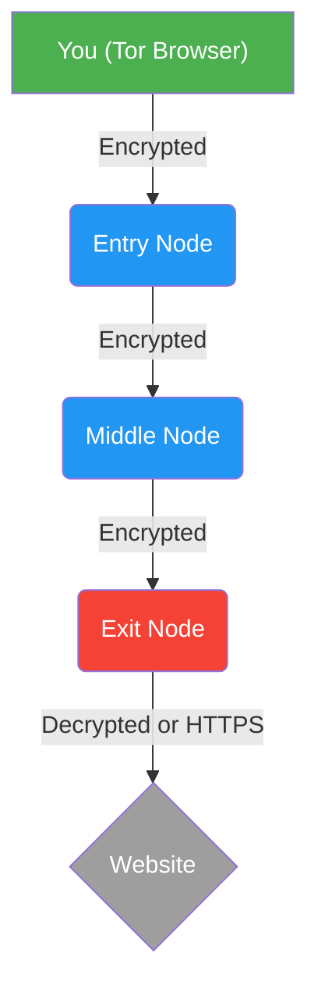

# Tor 브라우저: 심층 익명성 및 엣지 케이스 구성

*상태: 익명성 네트워크 아키텍처 | 대상: 내부 고발자, OSINT 연구원 및 고위험 대상*

Tor 브라우저는 "개인 정보 보호"를 제공하지 않고 **익명성**을 제공합니다. 개인정보 보호는 귀하가 세상에 보여줄 *무엇*을 결정합니다. 익명성은 세상이 당신이 누구인지* 알지 못하도록 보장하는 것입니다. Tor의 기본 어니언 라우팅은 암호화적으로 강력하지만 대부분의 비익명화 공격은 사용자가 엔드포인트에서 동작 또는 구성 오류를 범하기 때문에 성공합니다.

이 가이드에서는 DPI(심층 패킷 검사) 및 고급 브라우저 지문 인식을 유지하는 데 필요한 엄격한 배포 프로토콜에 대해 자세히 설명합니다.

---

## 1. Tor와 VPN: 중요한 차이점

활동가들은 종종 VPN과 Tor를 혼동합니다. 그것들은 완전히 다른 목적으로 사용됩니다:

* **VPN(가상 사설망):** 인터넷 서비스 제공업체(ISP)에서 기업 VPN 회사로 신뢰를 전환합니다. 이는 로컬 네트워크에서 트래픽을 숨기고 IP 주소를 변경하지만 VPN 제공업체는 귀하의 활동을 *기록할 수* 있습니다. **VPN은 귀하를 익명으로 만들지 않습니다.** 법 집행 기관이 VPN을 소환하고 데이터를 기록하는 경우 귀하의 신원이 손상됩니다.
* **Tor 브라우저:** **익명성**을 위해 특별히 설계되었습니다. 다층 암호화로 인해 *누구나*(Tor 네트워크의 개별 노드 포함)가 트래픽 페이로드를 IP 주소에 다시 연결하는 것이 수학적으로 불가능합니다.

## 2. 검열 우회: 플러그형 전송 및 브리지

적대적인 환경(권위주의 체제, 기업 네트워크, 대학 Wi-Fi)에서 공격자는 DPI(Deep Packet Inspection)를 배포하여 Tor 트래픽의 암호화 서명을 식별하고 차단합니다. DPI를 무력화하려면 플러그형 전송(브리지)을 사용해야 합니다.

브리지는 Tor 트래픽을 표준적이고 정상적인 웹 트래픽처럼 보이도록 위장하는 비공개 진입 노드입니다.

* **`obfs4`(난독화 4):** 표준 방어. Tor 트래픽을 난독화 계층으로 감싸서 인식할 수 없는 무작위 노이즈처럼 보이게 합니다. ISP가 알려진 Tor 노드를 단순히 차단하는 경우 이 방법을 사용하세요.
* **`Snowflake`:** 탄력성이 뛰어난 P2P 전송입니다. WebRTC를 사용하여 검열되지 않은 국가의 자원봉사자가 운영하는 임시 프록시를 통해 초기 연결을 라우팅하여 트래픽을 표준 화상 통화처럼 보이게 합니다. 매우 정교한 국가 방화벽에 대해 이를 사용하십시오.
* **`meek_azure`:** Microsoft의 Azure 클라우드 인프라를 통해 트래픽을 라우팅합니다. 검열관은 귀하가 Tor가 아닌 Microsoft에 연결되어 있는 것으로 확인합니다. 이를 차단하려면 Azure를 완전히 차단(도메인 프론팅)해야 하는데, 경제적 피해로 인해 검열관이 이를 꺼립니다.

**구성:** Tor 연결에 실패하면 **설정 > 연결 > 브리지**로 이동하여 내장 브리지를 선택하거나 Tor 프로젝트에서 직접 요청하세요.

## 3. 엄격한 행동 프로토콜(지문 인식 방지)

Tor를 사용할 때 목표는 다른 모든 Tor 사용자와 조화를 이루는 것입니다. 기본 프로필에서 벗어나면 추적자가 "브라우저 지문"을 구성하고 익명화할 수 있도록 하여 귀하를 고유하게 만듭니다.

### 1. 보안 슬라이더를 최대화하세요
기본적으로 Tor는 웹사이트가 중단되지 않도록 표준 웹 스크립트 실행을 허용합니다. 운영 보안을 위해 이는 용납될 수 없습니다.
* URL 표시줄에서 **방패 아이콘**을 클릭하세요.
* **고급 보안 설정**을 선택합니다.
* 레벨을 **안전**으로 변경하세요. 이렇게 하면 JavaScript(JS)가 전역적으로 완전히 비활성화됩니다. 악성 JS는 국가 수준의 공격자가 브라우저를 악용하고 익명화 악성 코드를 실행하는 데 사용하는 주요 벡터입니다. 사이트에서 JS가 작동하도록 요구하는 경우 다른 사이트를 찾으십시오.

### 2. 브라우저 창 크기를 조정하지 마세요.
브라우저 창을 최대화하면 웹사이트에서 화면의 정확한 픽셀 크기를 요청합니다. 이는 특정 모니터 크기와 그래픽 렌더링을 기반으로 매우 독특한 수학적 "캔버스 지문"을 생성합니다.
* **규칙:** Tor 브라우저 창을 열리는 기본 크기로 그대로 두십시오. 최대화를 클릭하지 마십시오.

### 3. 무관용 클리어넷 규칙
활동가가 저지를 수 있는 가장 치명적인 실수는 '교량 건설'입니다.
* **규칙:** Tor 브라우저를 사용하는 동안 개인 실명 계정(Facebook, 개인 Gmail, 은행 계좌)에 로그인하지 마십시오.
* *역학:* Tor를 통해 개인 Facebook에 로그인하면 익명의 Tor 종료 노드 회로가 Facebook 데이터베이스의 실제 신원에 직접 영구적으로 연결됩니다. 그런 다음 동일한 세션 내의 다른 탭에 있는 활동가 포럼을 방문하면 추적기가 해당 신원을 함께 연결할 수 있습니다.

## 4. 운영 파일 처리

* **온라인 상태에서 다운로드를 열지 마십시오:** Tor를 통해 문서(PDF, Word)를 다운로드하는 경우 인터넷에 연결된 동안 열지 마십시오. 많은 문서 형식에는 Tor를 우회하고 실제 IP 주소를 공개하는 순간 서버에 "전화 연결"하도록 설계된 내장 추적기 또는 매크로가 포함되어 있습니다.
* **완화:** 다운로드한 파일을 열기 전에 인터넷 연결을 완전히 끊거나 네트워크 액세스 없이 Qubes OS 또는 Tails OS 환경의 에어갭 'DispVM' 내에서만 파일을 여십시오.

_최종 업데이트: 2026_