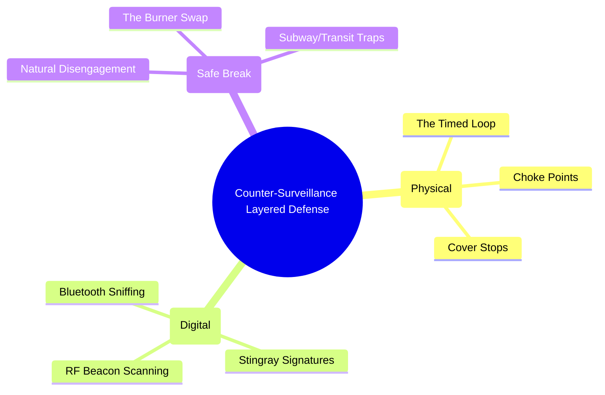

# 활동가를 위한 대감찰 가이드: 물리적-디지털 융합

*상태: 현장 매뉴얼 | 대상: 주최자, 직접 행동 팀, 고위험 노드*

반감시는 적과 싸우는 것이 아닙니다. 그것은 그들의 존재를 감지하고 당신이 그렇게 했다는 사실을 알리지 않은 채* 그들의 시선을 깨뜨리는 전략적 기술입니다. 공공연한 반감시 인식(예: 꼬리를 쳐다보는 것, 갑작스러운 유턴, 불규칙한 운전)을 나타내면 위협 수준이 높아지고 귀하를 정교한 표적으로 표시합니다.

이 매뉴얼은 물리적 도메인과 RF(무선 주파수) 도메인 모두에서 수동적 탐지 및 안전한 회피를 위한 프로토콜을 규정합니다.

---

## 1. 물리적 감지: 'Timed Loop'의 기술

민감한 작업 중에는 따라오고 있다고 가정해야 합니다. 당신의 목표는 부자연스러운 지리적 제약을 만들어 감시 팀이 자신의 모습을 드러내도록 하는 것입니다.

### Timed 루프 방법
A 지점(안전가옥)에서 B 지점(운영 회의)으로 직접 이동하지 마십시오. 경로 분석 루프를 구현합니다.
1. **초크 지점 설정:** 뒤따르는 모든 차량이 피할 수 없는 특정 병목 현상(예: 긴 다리, 터널, 즉시 출구가 없는 조용한 주거 거리)을 통과하도록 강제하는 대중교통 경로를 선택합니다.
2. **첫 번째 패스:** 초크 포인트를 통과합니다. 바로 뒤에 있는 세 대의 차량과 출구에서 어슬렁거리는 보행자에 대한 설명을 정신적으로 기록하십시오(또는 신중한 음성 녹음기를 사용하십시오).
3. **루프:** 크고 자연스럽게 보이는 루프를 실행합니다. 커피숍에 가서 20분 동안 서점을 둘러본 후(**커버 스톱**), 다른 각도에서 다시 관문을 향해 돌아갑니다.
4. **두 번째 패스:** 정확히 동일한 초크 포인트를 통과합니다.
5. **평가:** 두 번째 통행 중에 첫 번째 통행의 차량이나 보행자가 있으면 능동 감시를 받습니다. *반응하지 마세요.*

### 팀 역학 인식
전문 감시(T3/T4)는 결코 단일 차량이 아닙니다. "떠다니는 상자" 입니다.
* **지휘 차량:** 평행을 유지하며 한 블록 위로 이동합니다.
* **추종자:** 뒤에 머물면서 감지를 피하기 위해 리드를 다른 차량에 자주 넘겨줍니다.
* **눈:** 목적지에 도착하기도 전에 보행자나 자전거 운전자가 정차합니다.

---

## 2. 디지털 감지: 활성 RF 추적 식별

현대의 감시는 무선 주파수(RF)에 크게 의존합니다. 그들이 당신을 물리적으로 볼 수 없다면 디지털 방출을 추적하고 있는 것입니다.

### Wi-Fi/블루투스 군중 모니터링 감지
지역 경찰(T2)은 시위 지역에 모바일 RF 스니퍼를 배치하여 해당 지역의 모든 장치에서 MAC 주소를 수집하고 군중을 매핑하고 조직자를 식별합니다.
* **프로토콜:** 작전 구역에 들어가기 전에 기본 장치를 비행기 모드로 설정하세요. **결정적으로 Wi-Fi 및 Bluetooth도 수동으로 비활성화해야 합니다.** 최신 스마트폰의 비행기 모드는 장치의 고유 서명을 스캐너에 계속 브로드캐스팅하는 백그라운드 Bluetooth 비콘(예: Apple의 "Find My" 네트워크)을 자동으로 비활성화하지 *않습니다*.

### IMSI-Catchers(가오리) 식별
Stingrays는 기지국을 모방하여 휴대폰을 강제로 기지국에 연결하여 IMSI 번호를 수집하고 위치를 추적합니다.
* **공격의 서명:**
    * 5G/4G에서 2G(EDGE) 네트워크로의 갑작스럽고 설명할 수 없는 중단. (Stingray는 데이터를 가로채기 위해 휴대폰을 암호화되지 않은 오래된 2G 프로토콜로 강제 실행하는 경우가 많습니다.)
    * 비정상적으로 빠른 배터리 소모.
    * 신호의 "전체 막대"가 표시됨에도 불구하고 전화/문자 전송이 실패합니다.
* **대책:** Android(GrapheneOS와 같이 특별히 강화된 OS)에서는 네트워크 설정으로 이동하여 **2G 비활성화**를 수행하세요. 이는 가장 일반적인 다운그레이드 공격을 무효화합니다. 활성 Stingray가 의심되는 경우 장치의 전원을 완전히 끄고 패러데이 가방에 넣으십시오.

---

## 3. 회피: 안전 브레이크 프로토콜

감시를 확인하면 자연스럽게 "꼬리를 부러뜨리는" 것이 목표입니다. 당신은 당신을 잃은 그럴듯하고 순진한 이유를 감시팀에 제공해야 합니다.

### 자연스러운 분리
* **하지 말아야 할 것:** 달리거나 불규칙하게 운전하거나 감시에 맞서는 행위.
* **해야 할 일:** 매우 붐비는 다중 출구 환경(대형 백화점, 붐비는 지하철 역, 빽빽한 ​​호텔 로비)에 들어가세요.
* **지하철 함정:** 지하철 역에 들어가세요. 기차 문이 닫힐 때까지 플랫폼에서 기다리세요. 가능한 마지막 순간에 기차에 탑승하세요. 감시 요원이 따라가려고 하면 문으로 달려가거나(본인의 모습을 드러냄) 뒤에 남겨져야 합니다. 그들이 뒤에 남겨진다면 그들은 당신이 그들을 피하고 있는 것이 아니라 단순히 기차를 탔다고 가정합니다.

### 버너 교체(디지털 브레이크)
디지털 감시를 중단해야 하는 경우(예: 휴대폰 위치 추적 중):
1. "Cover Stop"(예: 쇼핑몰 화장실 또는 붐비는 카페)에 들어갑니다.
2. 기본 장치의 전원을 끄십시오. 가능하면 배터리를 제거하거나 즉시 패러데이 가방에 넣으십시오.
3. 사전 준비되고 연결되지 않은 버너 장치의 전원을 켭니다.
4. 다른 출구를 사용하여 Cover Stop에서 나오십시오. Cover Stop에서는 적의 디지털 추적이 정지된 상태로 유지됩니다.

**지침:** 가장 성공적인 역감시 작전은 적이 당신이 단순히 쇼핑을 갔다가 집으로 돌아간 지루하고 흥미롭지 않은 표적이라고 믿고 기지로 돌아가는 것입니다.

_최종 업데이트: 2026_

