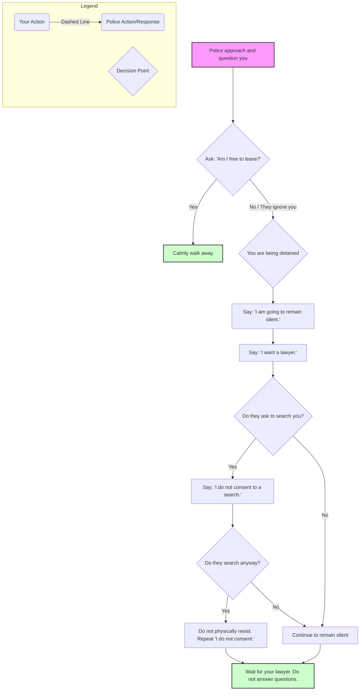

# Know Your Rights: A Guide for Activists in Chicago

This guide explains your fundamental rights when interacting with law enforcement in the United States, with a specific focus on Chicago. Understanding and asserting these rights can protect you.

**KEY LEGAL HOTLINES FOR CHICAGO:**
*   **National Lawyers Guild (NLG) Chicago:** (872) 465-4244
*   **First Defense Legal Aid (FDLA) 24/7 Hotline:** (800) 529-7374

Write these numbers on your arm or a piece of paper before a protest.

---

### **1. The Three Magic Phrases**

In almost any police interaction, these three phrases are your most powerful tools:

1.  **"Am I free to leave?"**
2.  **"I am going to remain silent."**
3.  **"I want a lawyer."**

Memorize them. Use them.

---

### **Police Interaction Flowchart**

This flowchart helps you decide what to do when you are stopped by police.

