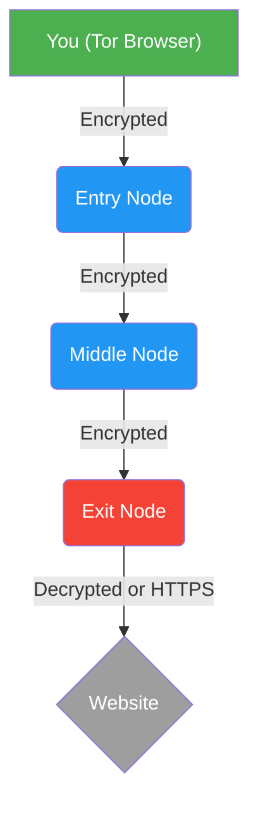

# Tor Browser: Deep Anonymity and Edge-Case Configuration

*Status: Anonymity Network Architecture | Audience: Whistleblowers, OSINT Researchers, and High-Risk Targets*

The Tor Browser does not provide "privacy"—it provides **anonymity**. Privacy is deciding *what* you show the world; anonymity is ensuring the world does not know *who* you are. While Tor's underlying onion routing is cryptographically robust, the majority of deanonymization attacks succeed because users make behavioral or configuration errors at the endpoints.

This guide details the strict deployment protocols required to survive Deep Packet Inspection (DPI) and advanced browser fingerprinting.

---

## 1. Tor vs. VPN: A Critical Distinction

Activists often confuse VPNs and Tor. They serve entirely different purposes:

*   **VPN (Virtual Private Network):** Shifts trust from your Internet Service Provider (ISP) to a corporate VPN company. It hides your traffic from your local network and changes your IP address, but the VPN provider *could* log your activity. **A VPN does NOT make you anonymous.** If law enforcement subpoenas a VPN (and they log data), your identity is compromised.
*   **Tor Browser:** Designed specifically for **anonymity**. The multi-layered encryption makes it mathematically unfeasible for *anyone* (including the individual nodes in the Tor network) to link your traffic payload back to your IP address.

## 2. Bypassing Censorship: Pluggable Transports and Bridges

In hostile environments (authoritarian regimes, corporate networks, university Wi-Fi), adversaries deploy Deep Packet Inspection (DPI) to identify the cryptographic signature of Tor traffic and block it. To defeat DPI, you must use a Pluggable Transport (a Bridge).

A Bridge is an unlisted Entry Node that disguises your Tor traffic to look like standard, benign web traffic.

*   **`obfs4` (Obfuscation 4):** The standard defense. It wraps Tor traffic in a layer of obfuscation, making it look like random, unrecognizable noise. Use this if your ISP simply blocks known Tor nodes.
*   **`Snowflake`:** A highly resilient peer-to-peer transport. It routes your initial connection through temporary proxies run by volunteers in uncensored countries using WebRTC, making your traffic look like a standard video call. Use this against highly sophisticated national firewalls.
*   **`meek_azure`:** Routes your traffic through Microsoft's Azure cloud infrastructure. The censor sees you connecting to Microsoft, not Tor. Blocking this requires blocking Azure entirely (Domain Fronting), which censors are reluctant to do due to economic damage.

**Configuration:** If Tor fails to connect, navigate to **Settings > Connection > Bridges** and select a built-in bridge or request one directly from the Tor Project.

## 3. Strict Behavioral Protocols (Defeating Fingerprinting)

When using Tor, your goal is to blend in with every other Tor user. Any deviation from the default profile makes you unique, allowing trackers to construct a "browser fingerprint" and deanonymize you.

### 1. Maximize the Security Slider
By default, Tor allows standard web scripts to run to ensure websites don't break. For operational security, this is unacceptable.
*   Click the **Shield Icon** in the URL bar.
*   Select **Advanced Security Settings**.
*   Change the level to **Safest**. This completely disables JavaScript (JS) globally. Malicious JS is the primary vector used by state-level adversaries to exploit browsers and execute deanonymization malware. If a site demands JS to function, find another site.

### 2. Never Resize the Browser Window
When you maximize a browser window, the website requests the exact pixel dimensions of your screen. This creates a highly unique mathematical "Canvas Fingerprint" based on your specific monitor size and graphics rendering.
*   **Rule:** Leave the Tor Browser window exactly at the default size it opens in. Do not click maximize.

### 3. The Zero-Tolerance Clear-Net Rule
The most catastrophic error an activist can make is "bridge building."
*   **Rule:** Never log into a personal, real-name account (Facebook, personal Gmail, bank account) while using the Tor Browser.
*   *Mechanics:* If you log into your personal Facebook over Tor, you have just permanently linked your anonymous Tor exit node circuit directly to your true identity in Facebook's database. If you then visit an activist forum in another tab within the same session, trackers can stitch those identities together.

## 4. Operational File Handling

*   **Do Not Open Downloads While Online:** If you download a document (PDF, Word) over Tor, do not open it while connected to the internet. Many document formats contain embedded trackers or macros designed to "phone home" to a server the moment they are opened, bypassing Tor and revealing your true IP address.
*   **Mitigation:** Disconnect from the internet completely before opening any downloaded file, or open them exclusively within an air-gapped `DispVM` on Qubes OS or a Tails OS environment without network access.

_Last Updated: 2026_


