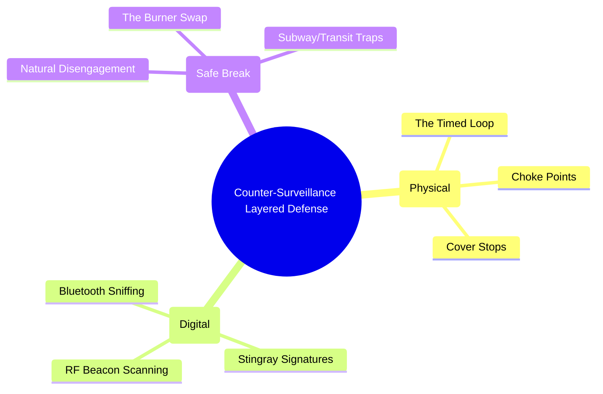

# The Activist's Guide to Counter-Surveillance: Physical-Digital Convergence

*Status: Field Manual | Audience: Organizers, Direct Action Teams, High-Risk Nodes*

Counter-surveillance is not about fighting the adversary; it is the strategic art of detecting their presence and breaking their line of sight *without* letting them know you have done so. Exhibiting overt counter-surveillance awareness (e.g., staring down a tail, sudden U-turns, erratic driving) escalates the threat level and marks you as a sophisticated target.

This manual dictates the protocols for passive detection and safe evasion across both physical and RF (Radio Frequency) domains.

---

## 1. Physical Detection: The Art of the 'Timed Loop'

You must assume you are being followed during sensitive operations. Your goal is to force the surveillance team to reveal themselves by creating unnatural geographical constraints.

### The Timed Loop Method
Never travel directly from Point A (safehouse) to Point B (operational meeting). Implement a Route Analysis Loop.
1.  **Establish a Choke Point:** Select a transit route that forces all following traffic through a specific, unavoidable bottleneck (e.g., a long bridge, a tunnel, a quiet residential street with no immediate turn-offs).
2.  **The First Pass:** Transit the choke point. Mentally log (or use a discreet voice recorder) the descriptions of the three vehicles directly behind you and any pedestrians loitering at the exit.
3.  **The Loop:** Execute a large, natural-seeming loop. Go to a coffee shop, browse a bookstore for 20 minutes (a **Cover Stop**), and then navigate back toward the choke point from a different angle.
4.  **The Second Pass:** Transit the exact same choke point.
5.  **Assessment:** If any of the vehicles or pedestrians from the First Pass are present during the Second Pass, you are under active surveillance. *Do not react.*

### Recognizing Team Dynamics
Professional surveillance (T3/T4) is never a single car. It is a "floating box."
*   **The Command Vehicle:** Stays parallel, running one block over.
*   **The Follower:** Stays behind, frequently handing off the lead to another vehicle to avoid detection.
*   **The Eye:** A pedestrian or cyclist stationed at your destination before you even arrive.

---

## 2. Digital Detection: Identifying Active RF Tracking

Modern surveillance relies heavily on Radio Frequency (RF). If they cannot see you physically, they are tracking your digital emissions.

### Detecting Wi-Fi / Bluetooth Crowd Monitoring
Local police (T2) deploy mobile RF sniffers in protest zones to harvest MAC addresses from all devices in the area, mapping the crowd and identifying organizers.
*   **Protocol:** Prior to entering an operational zone, place your primary device in airplane mode. **Crucially, you must also manually disable Wi-Fi and Bluetooth.** Airplane mode on modern smartphones *does not* automatically disable background Bluetooth beacons (like Apple's "Find My" network), which continue to broadcast your device's unique signature to scanners.

### Identifying IMSI-Catchers (Stingrays)
Stingrays mimic cell towers, forcing your phone to connect to them to harvest your IMSI number and track your location.
*   **Signatures of an Attack:**
    *   Sudden, unexplained drop from 5G/4G down to 2G (EDGE) networks. (Stingrays often force phones onto older, unencrypted 2G protocols to intercept data).
    *   Unusually rapid battery drain.
    *   Failure of calls/texts to transmit despite showing "full bars" of signal.
*   **Countermeasure:** On Android (specifically hardened OS like GrapheneOS), navigate to Network Settings and **Disable 2G**. This nullifies the most common downgrade attacks. If you suspect an active Stingray, power down the device entirely and place it in a Faraday bag.

---

## 3. Evasion: The Safe Break Protocol

If you confirm surveillance, your objective is to "break the tail" naturally. You must provide the surveillance team with a plausible, innocent reason for losing you.

### Natural Disengagement
*   **Do Not:** Run, drive erratically, or confront the surveillance.
*   **Do:** Enter a highly crowded, multi-exit environment (a large department store, a busy subway station, a dense hotel lobby).
*   **The Subway Trap:** Enter a subway station. Wait on the platform until the train doors are closing. Step onto the train at the last possible second. If the surveillance operative attempts to follow, they must rush the doors (revealing themselves) or be left behind. If they are left behind, they assume you simply caught the train, not that you were evading them.

### The Burner Swap (Digital Break)
If you must break digital surveillance (e.g., they are tracking your phone's location):
1.  Enter a "Cover Stop" (e.g., a mall bathroom or a crowded cafe).
2.  Power down your primary device. Remove the battery if possible, or place it immediately into a Faraday bag.
3.  Power on a pre-staged, unlinked Burner Device.
4.  Exit the Cover Stop using a different exit. The adversary's digital tracking will remain frozen at the Cover Stop.

**Directive:** The most successful counter-surveillance operation is one where the adversary returns to base believing you are simply a boring, uninteresting target who went shopping and went home.

_Last Updated: 2026_
